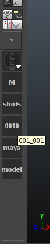

Introduction
============

What's all this about?
-----------------------

This tool aims to ease the workflow in productions where artists have to be switching from one shot/sequence/asset/task to another frequently. The main idea of this software is to be able to change context at any time in a easy and fast way, thus avoiding unnecessary and repetitive actions.

This tool attaches itself to Maya's toolbox and provides a custom context browser as well as bookmarks for previous selected contexts.

When initialized, the tools looks like this:

Installation
------------

Since this is a Maya specific plugin, it is recommended to build the software first, and manually add it to ``PYTHONPATH``, because Maya will not add the system python path's to itself.

.. code-block:: bash

    $ python setup.py build

After this, at least one interface must be added, thus ``resources/interfaces`` should be added to ``PYTHONPATH`` as well.

If you want Maya to start with this tool, add ``resources/maya`` to both ``PYTHONPATH`` and ``MAYA_SCRIPT_PATH``.

.. note::

    If no arguments specified when initializing the software, ``FileSystem`` interface will be picked up, and the current working directory will be the starting point, in Windows, most likely Maya's installation path. It is recommended to specify a starting point.

How do I use this?
------------------

The first button, which as the `EfestoLab <http://www.efestolab.uk/>`_ logo will server as a bookmark manager, left cliking on it, will spawn the list of bookmarks available.

The rest of the bottom buttons will be the current context. Right cliking on them will spawn a menu with their children. Clicking on any item of this menu will generate a new button, and the current context will be set. If the button has no children, it will be considered a leaf thus will be added to the bookmarks list.

.. tip::

    The names are shortened for because of the narrow space. The full names can be seen in the buttons if hovered for a bit of time.

How do I decide what's the current project?
-------------------------------------------

When calling the script trough :func:`efesto_mcontextpicker.main`, you can specify a main context, which by default will be the current working directory. By default, the script will initialize the ``FileSystem`` interface, which will basically be a folder explorer, stopping at any folder which contains a ``workspace.mel`` and setting the project to that folder if it's found.

How can I delete the saved preferences?
---------------------------------------

Preferences are handled by `QSettings <http://doc.qt.io/qt-4.8/qsettings.html>`_, in the documentation should be everything you need.

This script hides the Maya website button, why?
-----------------------------------------------

It's a pointless button, get over it.
