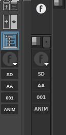

Introduction
============

What's all this about?
-----------------------

This tool aims to ease the workflow in productions where artists have to be switching from one shot/sequence/asset/task to another frequently. The main idea of this software is to be able to change context at any time in a easy and fast way, thus avoiding unnecessary and repetitive actions.

This tool attaches itself to Maya's toolbox or to a Nuke panel and provides a custom context browser as well as bookmarks for previous selected contexts.

When initialized, the tools looks like this in Maya and Nuke:

Installation
------------

build from sources :

.. code-block:: bash

    $ python setup.py build_plugin

Once built install in in the ftrack connect's plugin folder.

How do I use this?
------------------

The first button, which as the `EfestoLab <http://www.ftrack.uk/>`_ logo will server as a bookmark manager, left cliking on it, will spawn the list of bookmarks available.

The rest of the bottom buttons will be the current context. Right cliking on them will spawn a menu with their children. Clicking on any item of this menu will generate a new button, and the current context will be set. If the button has no children, it will be considered a leaf thus will be added to the bookmarks list.

.. tip::

    The names are shortened for because of the narrow space. The full names can be seen in the buttons if hovered for a bit of time.

How do I add the tool to Nuke's UI?
-----------------------------------

Right click on Nuke's side bar. Choose Split Vertical.

Right click on the new panel. Choose Windows -> Custom -> Context Picker.

The new panel can be saved as part of a workspace using Nuke's Workspace menu.

How can I delete the saved preferences?
---------------------------------------

Preferences are handled by `QSettings <http://doc.qt.io/qt-4.8/qsettings.html>`_, in the documentation should be everything you need.

This script hides the Maya website button, why?
-----------------------------------------------

It's a pointless button, get over it.
